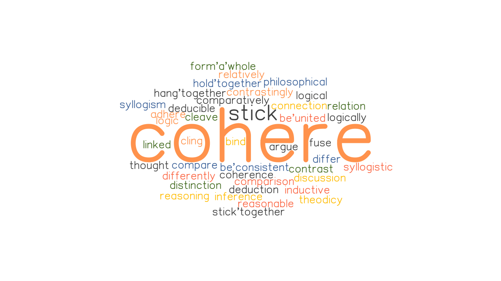

# Prompt_for_jobDescription

### Description

* Prompt engineering to build an API that derives entities out of a job description using Co:here

## What is Prompt enginnering?

* Prompt engineering is a concept in artificial intelligence, particularly natural language processing (NLP). In prompt engineering, the description of the task is embedded in the input, e.g., as a question instead of it being implicitly given.

## What are LLMs?

* Large language models (LLMs)—machine learning algorithms that can recognize, summarize, translate, predict, and generate human languages on the basis of very large text-based datasets—are likely to provide the most convincing computer-generated imitation of human language yet.

## What are prompts?

* A prompt is a portion of text that contains a description, examples, or patterns of the language task. It guides an LLM to give a favorable and contextual response to solve the language task. Simply put, it tells the LLM what you want it to do. LLMs can handle a wide range of tasks with only a few examples as input.

---

* <mark> This projects aims to provide custom FastAPIs with two ends. One of the ends gives scores to news and the other extracts features from job descriptions using prompts. It utilizes Co:here NLP toolkit which provides LLM. </mark>

---

## INSTALLATION GUIDE

* git clone https://github.com/Amanuel3065/pharmaceutical_sales_prediction
* cd pharmaceutical_sales_prediction
* pip install -r requirements.txt 

